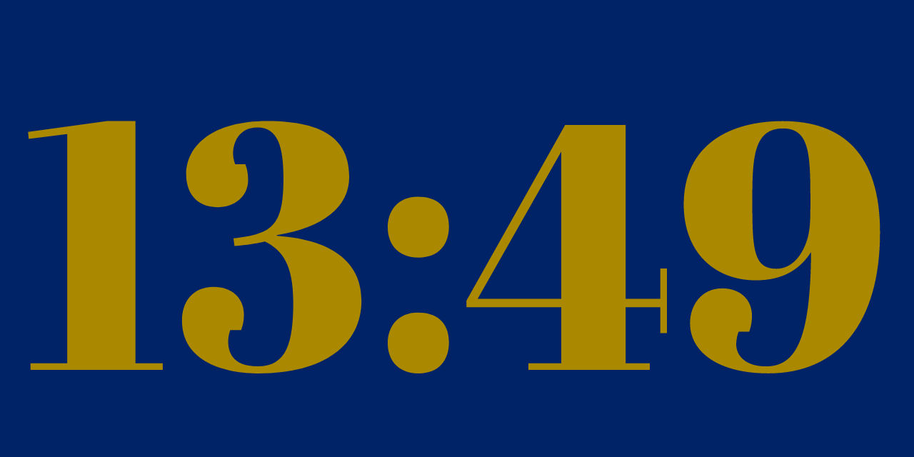

# Big-Time

## Stylish screensaver with an elegant hour and minutes display

 

 

## Also a brief revisit to Win32 API programming.

I was looking for a simple screensaver with digital hours and minutes display.

A quick Googling brings lots of hits, but most of them look slightly unsafe, otherwise dubious, or overcomplicated. Screensavers are maybe the easiest way of distributing malicious code to unsuspecting Windows users.

My solution: Write one myself.

## Choice of font

Most proportionally spaced fonts have fixed width digits to allow easy alignment of numeric data. The disadvantage of this is that when displaying numbers with narrow digits, like "11" for example, the gap between digits looks too wide compared to a pair of wider digits, like "00" or "88".

## Abril Fatface Regular 

Luckily I found a font that has elegant, strikingly unique, and visually interesting digits.

It's the ["Abril Fatface Regular"](https://www.type-together.com/abril-font) by Veronika Burian & José Scaglione.
The font is open source, and licensed under the [SIL Open Font License](href="fonts/AbrilFatface-Regular-License.txt), Version 1.1

You can admire it in the example screenshot above.

## Choice of Colors

The screensaver text and background colors are of course configurable.
Unfortunately, the Windows default color selector widget is slightly cumbersome to use, so I made a simple web page:

The ["Big-Time Color Picker"](https://martti.ylioja.com/big-time-colors.html) to make it more intuitive to adjust the colors. One still has to manually copy the RGB values from the page to update the configuration, but overall it's a big improvement.

The page uses the brilliant ["iro.js"](https://iro.js.org/) javascript color picker widget by "James". Check his [GitHub page](https://github.com/jaames/iro.js) for more info.
